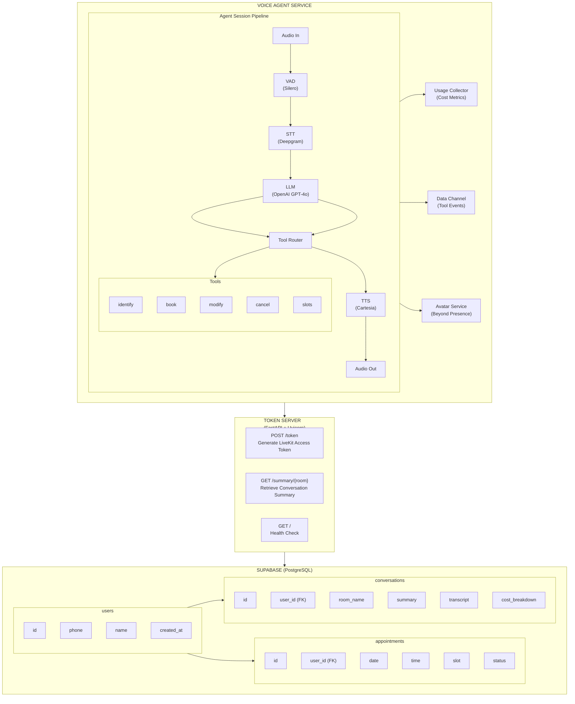

# Voice Agent Backend

A production-ready Python backend for AI-powered voice-based appointment scheduling. Built with LiveKit Agents framework, featuring real-time speech processing, intelligent tool calling, and comprehensive conversation analytics.

## Features

- **Real-Time Voice Pipeline** - Bidirectional audio communication via LiveKit
- **Speech Recognition** - High-accuracy STT via Deepgram Nova-2
- **Natural Voice Synthesis** - Human-like TTS via Cartesia Sonic-2
- **Intelligent Conversations** - GPT-4o-mini powered responses with tool calling
- **Voice Activity Detection** - Silero VAD for precise speech boundaries
- **AI Avatar Integration** - Optional Beyond Presence avatar support
- **Appointment Management** - Full CRUD operations for bookings
- **User Management** - Phone-based identification with new user registration
- **Conversation Analytics** - Summaries, transcripts, and cost tracking
- **RESTful Token Server** - FastAPI-based authentication

## Architecture



## Tech Stack

| Component | Technology | Version | Purpose |
|-----------|------------|---------|---------|
| Runtime | Python | 3.13+ | Application runtime |
| Voice Framework | LiveKit Agents | >=0.8.0 | Voice pipeline orchestration |
| STT | Deepgram | Nova-2 | Speech-to-Text |
| TTS | Cartesia | Sonic-2 | Text-to-Speech |
| LLM | OpenAI | GPT-4o-mini | Conversational AI |
| VAD | Silero | >=0.6.0 | Voice Activity Detection |
| Avatar | Beyond Presence | >=0.2.0 | AI Avatar rendering |
| Database | Supabase | >=2.0.0 | PostgreSQL client |
| API Server | FastAPI | >=0.109.0 | Token server framework |
| HTTP Server | Uvicorn | >=0.27.0 | ASGI server |
| Validation | Pydantic | >=2.0.0 | Data validation |
| HTTP Client | httpx | >=0.27.0 | Async HTTP requests |

## Project Structure

```
voice-agent-backend/
├── agent.py                  # Main voice agent entry point
├── token_server.py           # FastAPI token server
├── tools.py                  # Appointment management tools
├── requirements.txt          # Python dependencies
├── .env.example              # Environment template
├── .gitignore                # Git ignore rules
└── README.md                 # This file
```

## Getting Started

### Prerequisites

- Python 3.13 or higher
- pip or uv package manager
- API keys for all required services (see Environment Variables)

### Installation

```bash
# Navigate to backend directory
cd voice-agent-backend

# Create virtual environment
python -m venv venv

# Activate virtual environment
# On macOS/Linux:
source venv/bin/activate
# On Windows:
venv\Scripts\activate

# Install dependencies
pip install -r requirements.txt

# Copy environment template
cp .env.example .env
# Edit .env with your API keys
```

### Environment Variables

Create a `.env` file with the following configuration:

```env
# =============================================================================
# LIVEKIT CONFIGURATION
# =============================================================================
# Your LiveKit Cloud WebSocket URL
LIVEKIT_URL=wss://your-project.livekit.cloud

# LiveKit API credentials (from LiveKit Cloud dashboard)
LIVEKIT_API_KEY=your_api_key
LIVEKIT_API_SECRET=your_api_secret

# =============================================================================
# SPEECH-TO-TEXT (DEEPGRAM)
# =============================================================================
# Deepgram API key for speech recognition
DEEPGRAM_API_KEY=your_deepgram_api_key

# =============================================================================
# TEXT-TO-SPEECH (CARTESIA)
# =============================================================================
# Cartesia API key for voice synthesis
CARTESIA_API_KEY=your_cartesia_api_key

# =============================================================================
# LANGUAGE MODEL (OPENAI)
# =============================================================================
# OpenAI API key for GPT-4o-mini
OPENAI_API_KEY=your_openai_api_key

# =============================================================================
# DATABASE (SUPABASE)
# =============================================================================
# Supabase project URL
SUPABASE_URL=https://your-project.supabase.co

# Supabase anonymous key (for public access)
SUPABASE_KEY=your_supabase_anon_key

# =============================================================================
# AVATAR (OPTIONAL - BEYOND PRESENCE)
# =============================================================================
# Beyond Presence API key for AI avatar
BEY_API_KEY=your_beyond_presence_api_key

# Avatar ID to use
BEY_AVATAR_ID=your_avatar_id
```

### Database Setup

Run the following SQL in your Supabase SQL Editor:

```sql
-- Enable UUID extension
CREATE EXTENSION IF NOT EXISTS "uuid-ossp";

-- =============================================================================
-- USERS TABLE
-- =============================================================================
CREATE TABLE IF NOT EXISTS users (
    id UUID PRIMARY KEY DEFAULT uuid_generate_v4(),
    contact_number VARCHAR(20) UNIQUE NOT NULL,
    name VARCHAR(255),
    created_at TIMESTAMP WITH TIME ZONE DEFAULT NOW()
);

-- =============================================================================
-- APPOINTMENTS TABLE
-- =============================================================================
CREATE TABLE IF NOT EXISTS appointments (
    id UUID PRIMARY KEY DEFAULT uuid_generate_v4(),
    user_id UUID REFERENCES users(id) ON DELETE CASCADE,
    date DATE NOT NULL,
    time TIME NOT NULL,
    slot VARCHAR(50) NOT NULL,
    status VARCHAR(20) DEFAULT 'booked' CHECK (status IN ('booked', 'cancelled', 'completed')),
    created_at TIMESTAMP WITH TIME ZONE DEFAULT NOW(),
    updated_at TIMESTAMP WITH TIME ZONE DEFAULT NOW()
);

-- =============================================================================
-- CONVERSATIONS TABLE
-- =============================================================================
CREATE TABLE IF NOT EXISTS conversations (
    id UUID PRIMARY KEY DEFAULT uuid_generate_v4(),
    user_id UUID REFERENCES users(id) ON DELETE SET NULL,
    room_name VARCHAR(255),
    summary TEXT,
    appointments_discussed JSONB DEFAULT '[]',
    preferences_mentioned JSONB DEFAULT '[]',
    transcript JSONB DEFAULT '[]',
    cost_breakdown JSONB,
    duration_seconds INTEGER,
    created_at TIMESTAMP WITH TIME ZONE DEFAULT NOW()
);

-- =============================================================================
-- INDEXES
-- =============================================================================
CREATE INDEX IF NOT EXISTS idx_users_contact ON users(contact_number);
CREATE INDEX IF NOT EXISTS idx_appointments_user ON appointments(user_id);
CREATE INDEX IF NOT EXISTS idx_appointments_date_time ON appointments(date, time);
CREATE INDEX IF NOT EXISTS idx_appointments_status ON appointments(status);
CREATE INDEX IF NOT EXISTS idx_conversations_user ON conversations(user_id);
CREATE INDEX IF NOT EXISTS idx_conversations_room ON conversations(room_name);
```

### Running the Services

You need to run two services in separate terminals:

**Terminal 1 - Token Server:**
```bash
python token_server.py
```
Server starts on `http://localhost:8081`

**Terminal 2 - Voice Agent:**
```bash
python agent.py dev
```
Agent connects to LiveKit and waits for room participants.

## API Documentation

### Token Server Endpoints

#### Health Check

```http
GET /
```

**Response:**
```json
{
  "status": "ok",
  "message": "Voice Agent Token Server is running"
}
```

#### Generate Access Token

```http
POST /token
Content-Type: application/json

{
  "room_name": "room-abc123",
  "participant_name": "user-john"
}
```

**Response:**
```json
{
  "token": "eyJhbGciOiJIUzI1NiIs...",
  "room_name": "room-abc123",
  "participant_name": "user-john"
}
```

#### Get Conversation Summary

```http
GET /summary/{room_name}
```

**Response:**
```json
{
  "id": "550e8400-e29b-41d4-a716-446655440000",
  "user_id": "660e8400-e29b-41d4-a716-446655440001",
  "user_name": "John Smith",
  "user_phone": "1234567890",
  "room_name": "room-abc123",
  "summary": "The user booked an appointment for January 24, 2026 at 9 AM.",
  "appointments_discussed": [
    {
      "action": "booked",
      "date": "2026-01-24",
      "time": "09:00",
      "appointment_id": "abc12345"
    }
  ],
  "preferences_mentioned": [
    "Prefers morning appointments"
  ],
  "transcript": [...],
  "cost_breakdown": {
    "stt_cost": 0.0161,
    "tts_cost": 0.0105,
    "llm_cost": 0.0029,
    "total_cost": 0.0295
  },
  "duration_seconds": 172,
  "created_at": "2026-01-22T10:30:00Z"
}
```

## Voice Agent Tools

The AI assistant has access to the following tools for appointment management:

### identify_user

Identifies a user by their phone number or creates a new account.

**Parameters:**
| Name | Type | Description |
|------|------|-------------|
| phone_number | string | 10-digit phone number |
| name | string | (Optional) User's name for new registration |

**Behavior:**
- If user exists: Returns user info and their appointments
- If user doesn't exist and name provided: Creates new user
- If user doesn't exist and no name: Prompts for name

### fetch_available_slots

Retrieves available appointment slots for a given date.

**Parameters:**
| Name | Type | Description |
|------|------|-------------|
| date | string | Date in YYYY-MM-DD format |

**Returns:**
- List of available time slots
- Excludes already booked slots
- Only weekdays (Monday-Friday)
- Slots: 9 AM - 4 PM (hourly)

### book_appointment

Books a new appointment for the identified user.

**Parameters:**
| Name | Type | Description |
|------|------|-------------|
| date | string | Date in YYYY-MM-DD format |
| time | string | Time in HH:MM format |

**Returns:**
- Confirmation with appointment ID (8-character code)
- Error if slot unavailable or user not identified

### get_user_appointments

Retrieves all appointments for the identified user.

**Parameters:** None (uses session context)

**Returns:**
- List of appointments with date, time, status
- Sorted by date (newest first)

### modify_appointment

Reschedules an existing appointment.

**Parameters:**
| Name | Type | Description |
|------|------|-------------|
| appointment_id | string | 8-character confirmation code |
| new_date | string | New date in YYYY-MM-DD format |
| new_time | string | New time in HH:MM format |

**Returns:**
- Confirmation of rescheduled appointment
- Error if slot unavailable or appointment not found

### cancel_appointment

Cancels an existing appointment.

**Parameters:**
| Name | Type | Description |
|------|------|-------------|
| appointment_id | string | 8-character confirmation code |

**Returns:**
- Confirmation of cancellation
- Appointment status changed to 'cancelled'

### end_conversation

Gracefully ends the conversation and triggers summary generation.

**Parameters:**
| Name | Type | Description |
|------|------|-------------|
| reason | string | (Optional) Reason for ending |

**Behavior:**
- Generates AI summary of conversation
- Saves transcript and analytics to database
- Sends summary to frontend via data channel

## Available Appointment Slots

| Day | Hours | Slot Duration |
|-----|-------|---------------|
| Monday - Friday | 9:00 AM - 4:00 PM | 1 hour |
| Saturday - Sunday | Not Available | - |

**Slots:**
- 9:00 AM - 10:00 AM
- 10:00 AM - 11:00 AM
- 11:00 AM - 12:00 PM
- 12:00 PM - 1:00 PM
- 1:00 PM - 2:00 PM
- 2:00 PM - 3:00 PM
- 3:00 PM - 4:00 PM

## Cost Tracking

The system tracks usage costs for transparency:

| Service | Metric | Price |
|---------|--------|-------|
| Deepgram STT | Per minute | $0.0058 |
| Cartesia TTS | Per character | $0.0000099 |
| OpenAI GPT-4o-mini | Input tokens | $0.15 / 1M |
| OpenAI GPT-4o-mini | Output tokens | $0.60 / 1M |

**Example Conversation Cost:**
- Duration: 2-3 minutes
- STT: ~$0.016
- TTS: ~$0.010
- LLM: ~$0.003
- **Total: ~$0.03**

## Testing Scenarios

### Scenario 1: New User Registration & Booking

```
User: "Hi, I'd like to book an appointment"
Agent: "Hello! I'd be happy to help. May I have your phone number?"
User: "My number is 9876543210"
Agent: "I don't see an account with that number. Would you like to create one? What's your name?"
User: "Yes, my name is Sarah Johnson"
Agent: "Welcome Sarah! I've created your account. When would you like your appointment?"
User: "Tomorrow at 2 PM please"
Agent: "I've booked your appointment for tomorrow at 2 PM. Your confirmation code is def67890."
```

### Scenario 2: Returning User - View & Modify

```
User: "Hello, I need to check my appointments"
Agent: "Sure! What's your phone number?"
User: "1234567890"
Agent: "Welcome back John! You have an appointment on January 24th at 9 AM. Would you like to modify it?"
User: "Yes, can I change it to 11 AM?"
Agent: "Done! Your appointment is now at 11 AM on January 24th."
```

### Scenario 3: Cancel Appointment

```
User: "I need to cancel my appointment"
Agent: "I can help with that. What's your phone number?"
User: "1234567890"
Agent: "I found your appointment on January 24th at 11 AM. Should I cancel it?"
User: "Yes please"
Agent: "Your appointment has been cancelled. Is there anything else?"
User: "No, goodbye"
Agent: "Thank you for calling. Have a great day!"
```

### Scenario 4: Check Slot Availability

```
User: "What times are available on Friday?"
Agent: "Let me check Friday's availability. Available slots are:
        - 9:00 AM
        - 10:00 AM
        - 1:00 PM
        - 3:00 PM
        Which would you prefer?"
```

### Testing Checklist

| Test | Input | Expected Output |
|------|-------|-----------------|
| New user registration | Phone + Name | User created, confirmation |
| Existing user lookup | Valid phone | User info + appointments |
| Invalid phone format | "123" | Error: invalid format |
| Book available slot | Valid date/time | Appointment confirmed |
| Book unavailable slot | Booked slot | Error: slot unavailable |
| Weekend booking | Saturday date | Error: weekends unavailable |
| Modify appointment | Valid ID + new time | Appointment updated |
| Cancel appointment | Valid ID | Status changed to cancelled |
| Invalid appointment ID | Random string | Error: not found |
| End conversation | "Goodbye" | Summary generated |

## Voice Pipeline Configuration

### VAD (Voice Activity Detection)
```python
silero.VAD.load(
    min_silence_duration=0.5,  # Seconds of silence to detect end of speech
    min_speech_duration=0.1,   # Minimum speech duration to trigger
)
```

### STT (Speech-to-Text)
```python
deepgram.STT(
    model="nova-2",
    language="en-US",
    smart_format=True,
    punctuate=True,
)
```

### LLM (Language Model)
```python
openai.LLM(
    model="gpt-4o-mini",
    temperature=0.7,
)
```

### TTS (Text-to-Speech)
```python
cartesia.TTS(
    model="sonic-2",
    voice_id="829ccd10-f8b3-43cd-b8a0-4aeaa81f3b30",
    speed=0.4,  # Slower for clarity
)
```

## Performance

### Expected Latencies

| Operation | Latency |
|-----------|---------|
| Speech detection (VAD) | ~100ms |
| Speech-to-Text | 200-500ms |
| LLM Response | 500-1500ms |
| Text-to-Speech | 200-400ms |
| **Total (no tools)** | **1.5-3 seconds** |
| **Total (with tools)** | **3-5 seconds** |

### Optimization Tips

1. **Prewarm Models** - VAD models are loaded at startup
2. **Streaming Enabled** - All components use streaming
3. **Fast LLM** - GPT-4o-mini chosen for speed
4. **Interruption Handling** - Users can interrupt the agent

## Troubleshooting

### Common Issues

1. **Agent not connecting**
   - Verify LiveKit credentials
   - Check `LIVEKIT_URL` format (must start with `wss://`)
   - Ensure agent is running with `dev` flag

2. **No audio output**
   - Verify Cartesia API key
   - Check TTS voice ID is valid

3. **Speech not recognized**
   - Verify Deepgram API key
   - Check microphone permissions on client

4. **Tools not executing**
   - Check Supabase credentials
   - Verify database tables exist
   - Check network connectivity

5. **Avatar not appearing**
   - Beyond Presence credentials required
   - Avatar ID must be valid

### Debug Mode

Run with verbose logging:
```bash
LOGLEVEL=DEBUG python agent.py dev
```

## Related Repositories

- **Frontend**: [voice-agent-frontend](https://github.com/SahanaGS-tech/voice-agent-frontend) - React/TypeScript frontend with LiveKit client, AI avatar display, and conversation analytics UI
